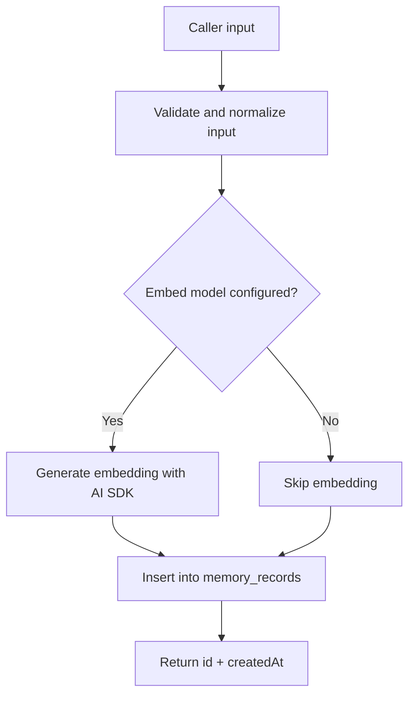
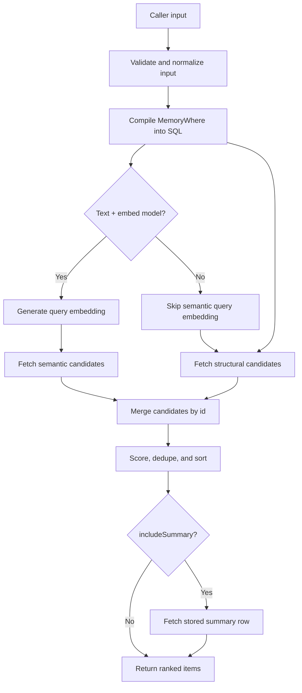
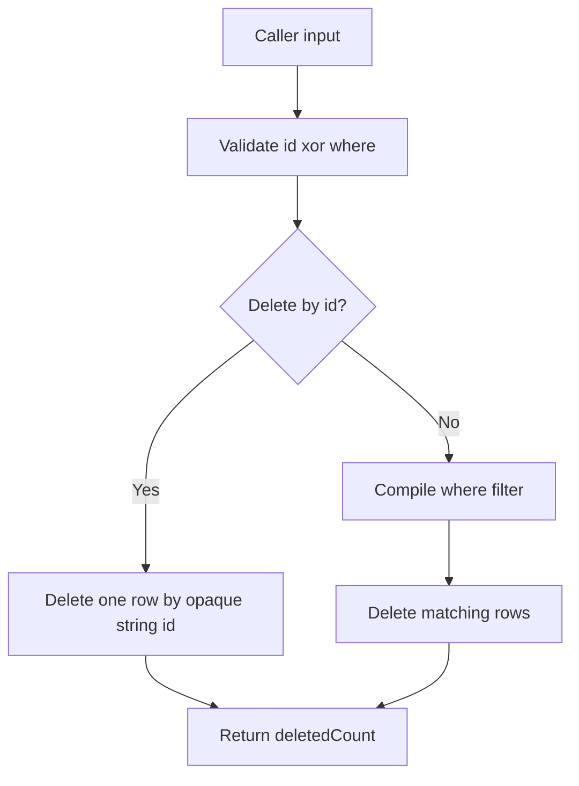

# Data Flow

This document follows the current runtime behavior from public input to return
value.

## `remember()`

Detailed flow:

1. reject malformed input early
2. default `metadata` to `{}`
3. default `priority` to `1`
4. default `source` to `"system"`
5. default `createdAt` to `now()`
6. set `updatedAt` to the same timestamp for the initial write
7. optionally embed `content`
8. insert into `memory_records`
9. return the inserted `id` and `createdAt`

## `context()`

Detailed flow:

1. validate `where`, `text`, `limit`, and `includeSummary`
2. compile the metadata filter into deterministic JSONB SQL
3. fetch structural candidates from the metadata scope
4. if semantic retrieval is available, fetch semantic candidates from the same scope
5. merge both result sets by `id`
6. compute a final score per candidate
7. dedupe near-identical content conservatively
8. sort by score, then priority, then recency
9. apply `limit`
10. if requested, fetch one stored summary row from the same scope
11. return `{ items, summary? }`

## `forget()`

Detailed flow:

1. reject malformed inputs early
2. enforce that exactly one of `id` or `where` is present
3. if `id` is provided, delete by opaque string id
4. if `where` is provided, compile the filter and delete the matching set
5. return `{ deletedCount }`
